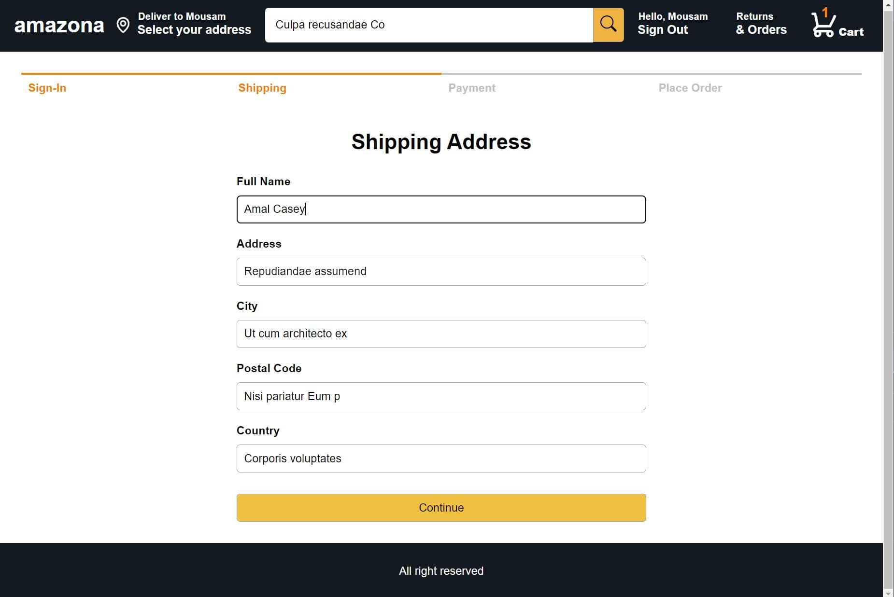

# Amazon Clone E-commerce App

## Overview

This project is an Amazon Clone E-commerce application built with a modern web stack. The frontend is developed using React and Redux for efficient state management, while the backend is powered by Node.js and MongoDB. The app aims to replicate key functionalities of Amazon, including user authentication, product browsing, cart management, and order processing.

## Features

-   **User Authentication**: Secure login and registration using JWT (JSON Web Tokens).
-   **Product Browsing**: View and search for products with detailed descriptions and images.
-   **Shopping Cart**: Add, remove, and update items in the cart.
-   **Order Management**: Place orders and view order history.

## Tech Stack

### Frontend

-   **React**: For building user interfaces.
-   **Redux**: For state management.
-   **React Router**: For client-side routing.
-   **Axios**: For making HTTP requests to the backend.

### Backend

-   **Node.js**: For server-side JavaScript runtime.
-   **Express.js**: For building the RESTful API.
-   **MongoDB**: For the NoSQL database.
-   **Mongoose**: For object data modeling (ODM) with MongoDB.

